## Demo video
https://drive.google.com/file/d/1OCE5iyreGN--iFjRNJ3OpfcdAhzAL0Ac/view?usp=sharing

## 📱 Screenshots

### 🛡️ Admin Dashboard

> [!NOTE]
> The Admin Dashboard provides comprehensive tools for organization management, AI-driven skill gap analysis, and training orchestration.

#### 1. Core Onboarding & Auth
*   **Landing Page**: The main entrance of the Skillio platform.
    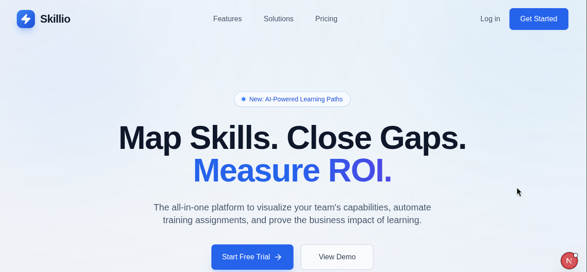
*   **Email Verification**: Secure onboarding flow for new organization accounts.
    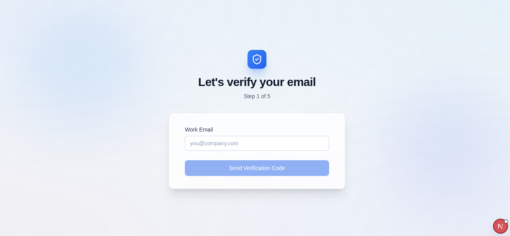
*   **Authentication**: Integrated login for both Company Administrators and Employees.
    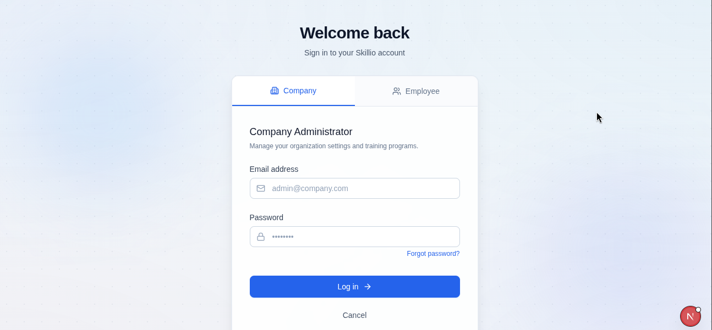

#### 2. Organization & Talent Management
*   **Employee Management**: Centralized directory to track talent across the organization.
    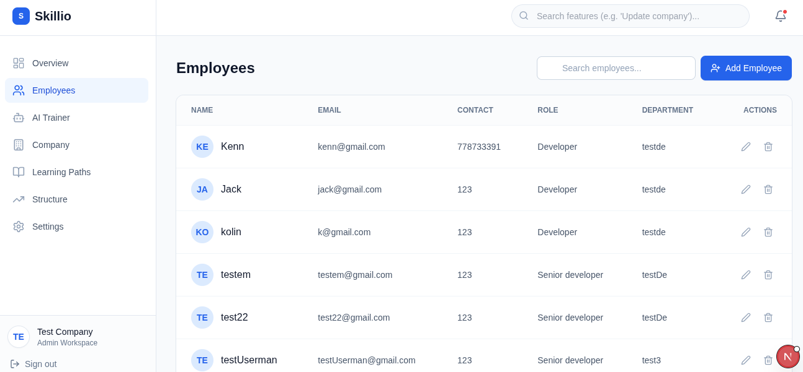
*   **Organization Structure**: Visual mapping of departments and teams.
    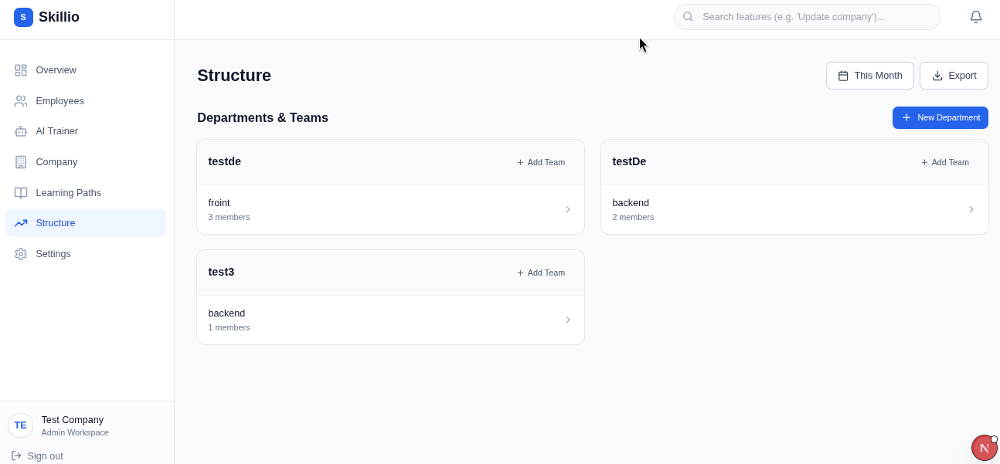
*   **Company Profile**: Customizable organization branding and contact information.
    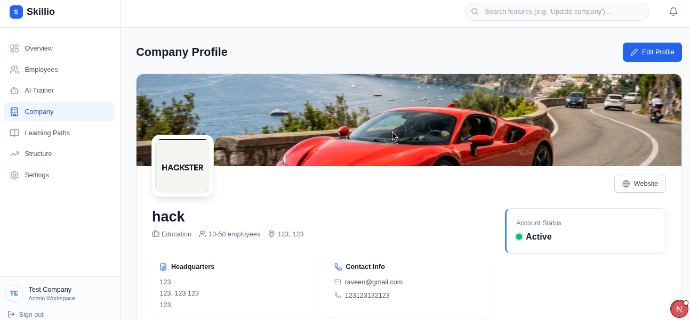

#### 3. AI Training & Architecture
*   **AI Skill Identification**: Automated analysis of employee skills and training needs.
    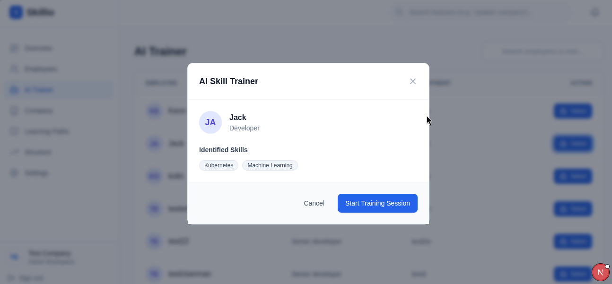
*   **Job Role Definition**: Management of standard roles and required skill levels.
    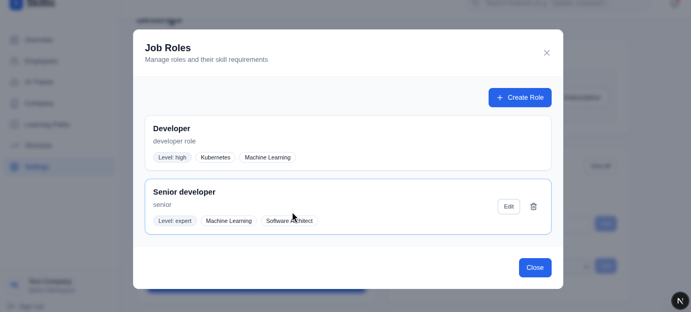
*   **Role Creation**: Tools to define new positions and proficiency expectations.
    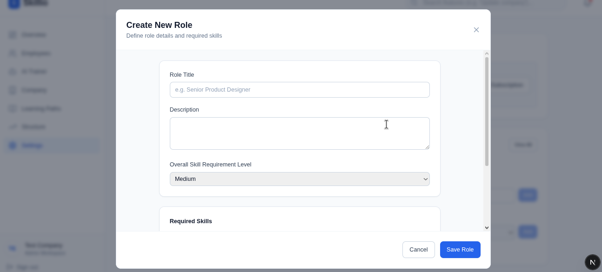
*   **AI Curriculum Generation**: Real-time generation of tailored evaluation modules.
    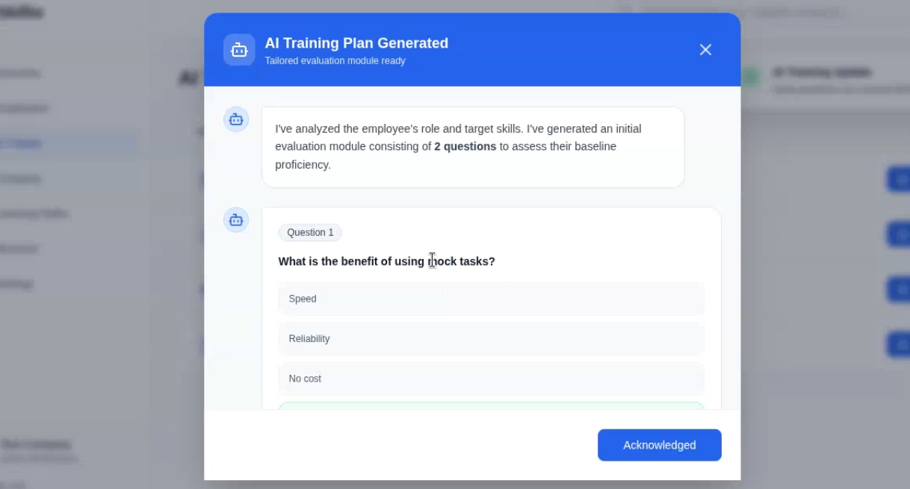

#### 4. Subscription & Billing
*   **Billing & Settings**: Comprehensive control over subscriptions and job architecture.
    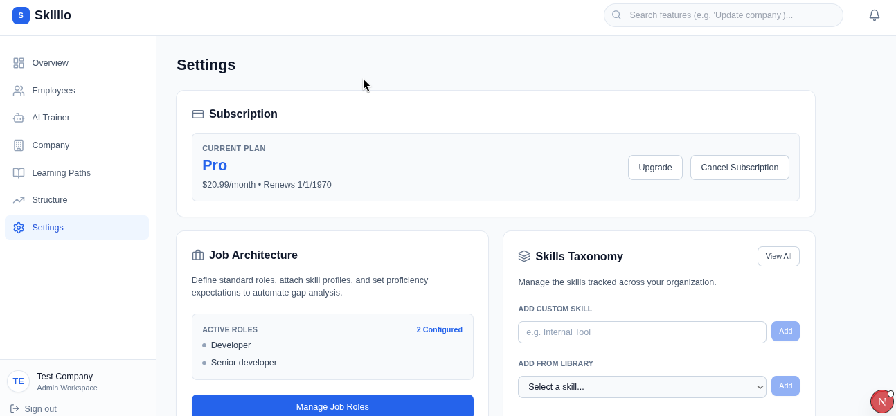
*   **Plan Management**: Flexible scaling options with multiple service tiers.
    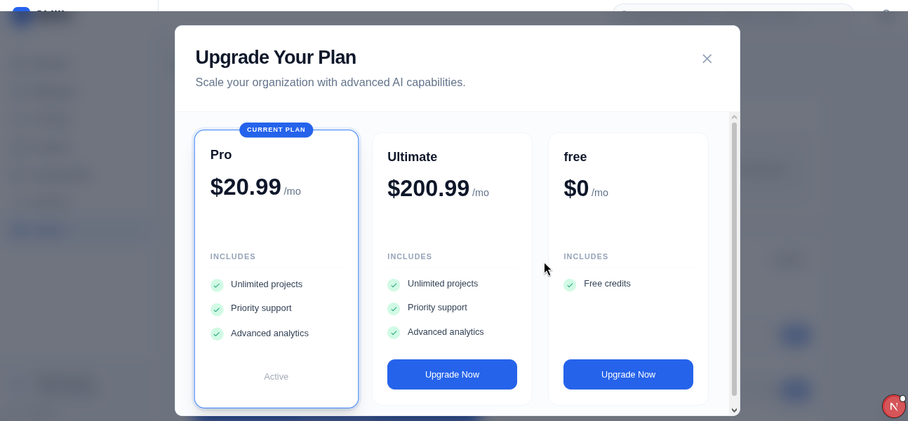
*   **Secure Payments**: Integrated Stripe checkout for seamless plan upgrades.
    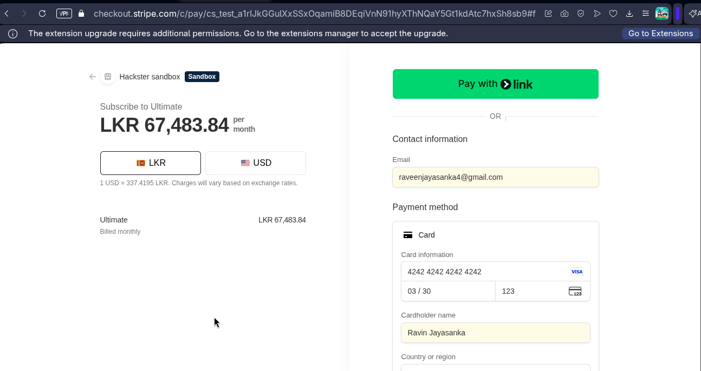

---

### 🎓 Employee Dashboard

> [!TIP]
> The Employee Portal offers a personalized learning experience with AI-generated content tailored to specific skill gaps.

*   **Initial Assessment**: Adaptive baseline testing to personalize the learning path.
    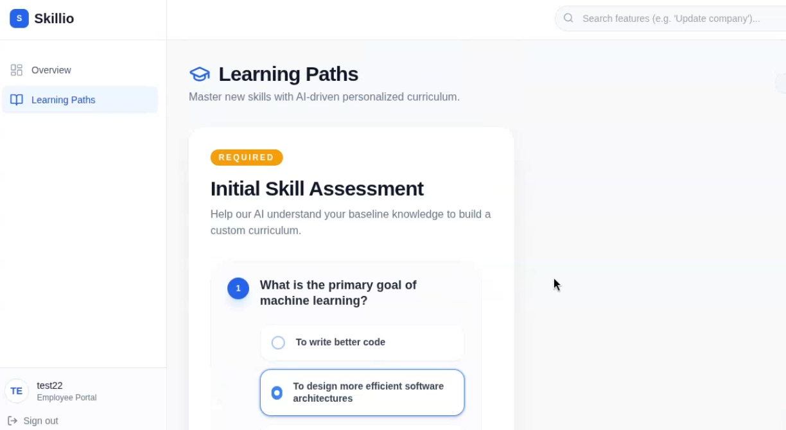
*   **Personalized Learning Paths**: AI-curated courses specifically for the employee's role.
    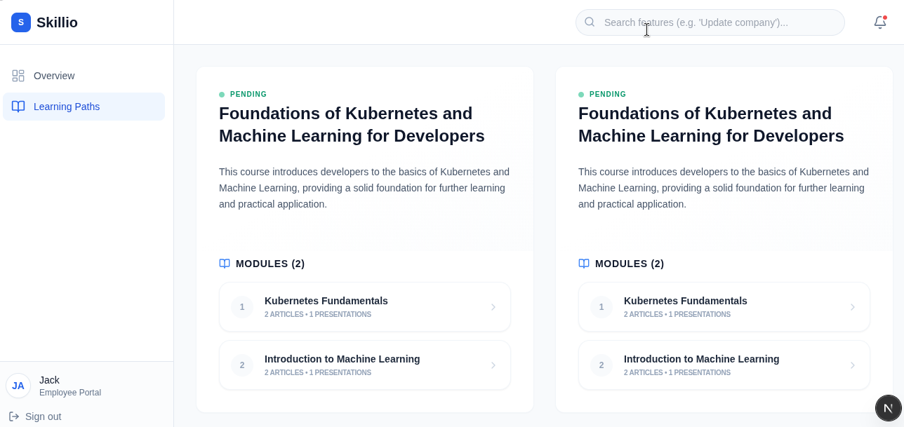
*   **Article-Based Learning**: Deep-dive content with executive summaries and detailed articles.
    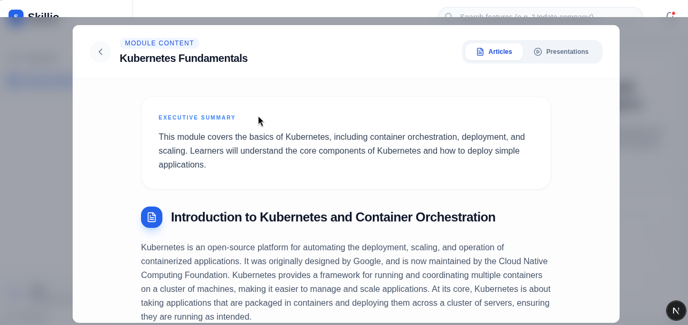
*   **Interactive Presentations**: Slide-based learning with integrated AI narration.
    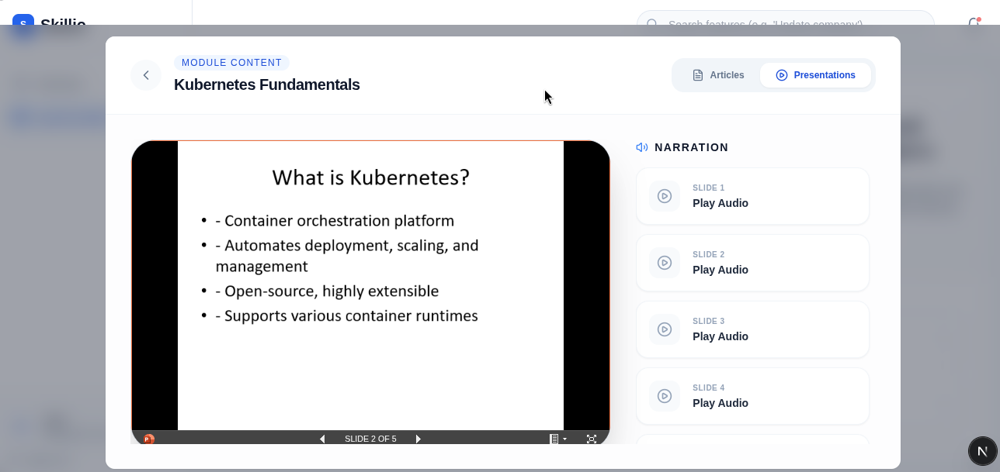

# 🚀 Getting Started & Setup Guide

This comprehensive guide takes you from cloning the repository to a fully running local development environment for **Skillio**.

---

## 📋 Prerequisites
Before setting up the project, ensure you have the following installed on your local machine:
- **Node.js** (v18.x or higher)
- **Python** (v3.10 or higher)
- **MongoDB** (Local instance running, or a MongoDB Atlas cloud database)
- **Redis** (Required for Celery task queuing and SSE notifications, running on `localhost:6379`)
- **Stripe CLI** (For capturing payment webhook events locally)

---

## 🛠️ Infrastructure & Service Accounts Setup

To fully run **Skillio**, you will need to set up credentials for the following external services:

### 1. MongoDB Database Setup
- **Option A (Local)**: Install MongoDB locally and get your connection string (usually `mongodb://localhost:27017/skillio_official`).
- **Option B (Atlas Cloud)**: 
  1. Create a free cluster on [MongoDB Atlas](https://www.mongodb.com/cloud/atlas).
  2. Create a database user with read/write permissions.
  3. Whitelist your current IP address (or `0.0.0.0/0` for testing).
  4. Copy the connection string (e.g. `mongodb+srv://<username>:<password>@cluster.mongodb.net/?appName=Cluster0`).

### 2. Redis Setup
- **Linux**: Install via your package manager (e.g. `sudo apt install redis-server`) and run with `redis-server`.
- **macOS**: Install via Homebrew (`brew install redis`) and start with `brew services start redis`.
- **Windows**: Use WSL or install Redis via Memurai or MSI installer. Make sure it runs on standard port `6379`.

### 3. Stripe Setup (Payments)
1. Register for a free [Stripe Developer Account](https://stripe.com).
2. Go to the Developer Dashboard to obtain your API Keys:
   - **Publishable Key**: `pk_test_...`
   - **Secret Key**: `sk_test_...`
3. Download and authenticate the **Stripe CLI** to forward webhook events:
   - Login: `stripe login`
   - Listen for webhook events: `stripe listen --forward-to localhost:5000/api/webhook`
   - Copy the webhook signing secret returned by CLI (e.g. `whsec_...`) into your `.env` configuration.

### 4. Cloudinary Setup (Media & Profile Pictures)
1. Sign up for a [Cloudinary](https://cloudinary.com) account.
2. Navigate to your Dashboard and copy:
   - **Cloud Name**
   - **API Key**
   - **API Secret**

### 5. Groq Setup (AI Generation Engine)
1. Create an account on [Groq Console](https://console.groq.com/).
2. Generate an API Key under **API Keys**.
3. Choose a fast model (e.g., `qwen/qwen3-32b` or similar depending on current configuration).

### 6. Mailjet Setup (Transactional Email Alerts)
1. Sign up for [Mailjet](https://www.mailjet.com/).
2. Retrieve your **API Key** and **Secret Key** from the account configuration.
3. Configure a verified **Sender Email** to dispatch security codes.

---

## 🔌 Environment Variables

### Backend Configuration (`skillio-backend/.env`)
Create a `.env` file in the `skillio-backend/` directory:
```env
MONGO_DB_URL=mongodb+srv://<username>:<password>@cluster0.mongodb.net/?appName=Cluster0
STRIPE_SECRET=sk_test_...
STRIPE_PUBLISHABLE_KEY=pk_test_...
STRIPE_WEBHOOK_SECRET=whsec_...
FRONTEND_URL=http://localhost:3000
SECRET_KEY=your_flask_secret_key
CLOUDINARY_CLOUD_NAME=your_cloudinary_cloud_name
CLOUDINARY_API_KEY=your_cloudinary_api_key
CLOUDINARY_API_SECRET=your_cloudinary_api_secret
GROQ_KEY=gsk_...
GROQ_MODEL=qwen/qwen3-32b
JWT_SECRET=your_jwt_secret_key
MAILJET_SECRET=your_mailjet_secret_key
MAILJET_API_KEY=your_mailjet_api_key
MAILJET_SENDER_EMAIL=your_verified_sender_email@domain.com
```

### Frontend Configuration (`skillio-frontend/.env.local`)
Create a `.env.local` file in the `skillio-frontend/` directory:
```env
MONGODB_URI="mongodb+srv://<username>:<password>@cluster0.mongodb.net/?appName=Cluster0"
MONGODB_DB="skillioDB"
JWT_SECRET="your_jwt_secret_key"
NEXT_PUBLIC_DEV_STATUS="development"
NEXT_PUBLIC_BACKEND_URL="http://127.0.0.1:5000"
```

---

## 🏃 Local Run Instructions

To run the application locally, you will need 4 terminal tabs:

### Step 1: Run local Redis server
Ensure Redis is running:
```bash
redis-server
```

### Step 2: Start Backend Server
1. Navigate to the backend directory:
   ```bash
   cd skillio-backend
   ```
2. Create and activate a Python virtual environment:
   ```bash
   windows
   
   python -m venv .venv
   .venv\Scripts\Activate.ps1
   
   Linux

   python3 -m venv .venv
   source .venv/bin/activate
   ```
3. Install dependencies:
   ```bash
   pip install -r requirements.txt
   ```
4. Run the Flask server:
   ```bash
   python run.py
   ```
   *The Flask API will run on `http://localhost:5000`.*
### Step 2.1: run docker redis
```bash
docker run -d -p 6379:6379 --name redis redis:latest
```
### Step 3: Run Celery Worker (Background AI Generation tasks)
Open a new terminal tab, navigate to the backend directory, activate virtual environment, and run:
```bash
cd skillio-backend
source .venv/bin/activate
celery -A celery_worker.celery_app worker --loglevel=info

windows
celery -A celery_worker.celery_app worker --loglevel=info --pool=solo

```

### Step 4: Stripe Webhook Forwarding
Open a new terminal tab and start forwarding Stripe webhook events:
```bash
stripe listen --forward-to localhost:5000/api/webhook
```

### Step 5: Start Frontend Server
1. Open a new terminal tab and navigate to the frontend directory:
   ```bash
   cd skillio-frontend
   ```
2. Install dependencies:
   ```bash
   npm install
   ```
3. Run the development server:
   ```bash
   npm run dev
   ```
   *The Next.js frontend will run on `http://localhost:3000`.*

---
## Test API curl requests
- AI test
```
curl -X POST http://localhost:5000/test-celery      -H "Content-Type: application/json"      -d '{
       "target_skills": ["React", "TypeScript", "Tailwind CSS"],
       "role": "Frontend Developer"
     }'
```

```
curl -X POST http://127.0.0.1:5000/test-create-course      -H "Content-Type: application/json"      -d '{"contentID": "6a018574793ebdac8728c2f3","role": "Software Engineer","target_skills": ["Python", "Flask", "Celery"],"proficiencyLevel": "Medium"}'
```
## AI Requirements
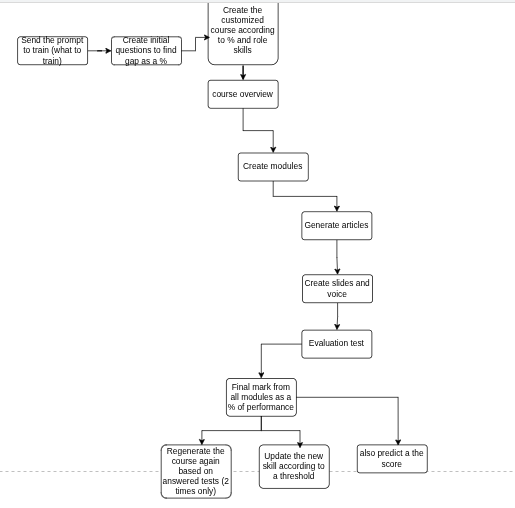

## Running Tests
To run all backend test cases, use `pytest` from the `skillio-backend` directory:

```bash
cd skillio-backend
pytest
or
pytest --ignore=test_out.txt
```

Tests perform actual operations on the database specified in your environment (`MONGO_DB_URL`) or a local `test_db` by default. The test database is dropped before each test that uses the `clean_db` fixture.
