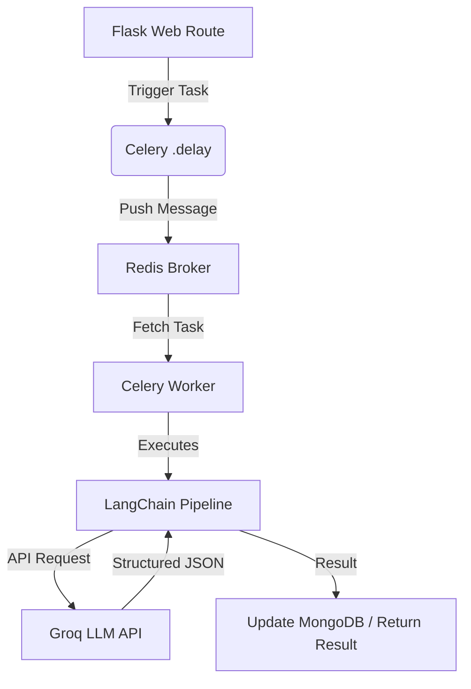
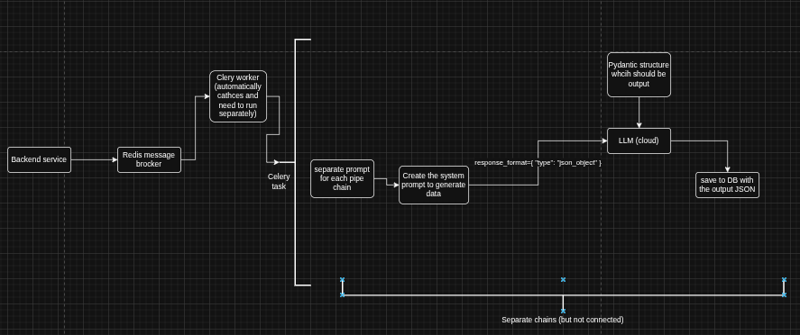

# Skillio AI Architecture & Workflow Manual

This document explains how AI-powered features are implemented in the Skillio project, using **LangChain** for orchestration and **Celery** for asynchronous background processing.

## 1. Overview

The AI system is designed to generate complex training content (questions, course overviews, modules) without blocking the user interface. It follows an asynchronous producer-consumer pattern.

### Technology Stack:
- **LLM Provider**: [Groq](https://groq.com/) (using models like Llama-3 or Qwen).
- **Orchestration**: [LangChain](https://www.langchain.com/) (for prompt management and structured output).
- **Task Queue**: [Celery](https://docs.celeryq.dev/) (to handle background processing).
- **Message Broker**: [Redis](https://redis.io/) (as the transport layer for Celery).
- **Data Validation**: [Pydantic](https://docs.pydantic.dev/) (to enforce structured JSON output from the AI).

---

## 2. Architecture Diagram



## Important
**For a production backend using MongoEngine, Service-Level Orchestration is required. If you put all four stages into one massive LangChain pipeline, a failure at the "Slides" generation step would cause the entire request to crash, losing the Overview, Modules, and Articles that were already successfully generated. Furthermore, HTTP requests would time out.**

**Instead, you create individual LCEL chains for each stage and use standard Python to pass the data between them, allowing you to save state to MongoDB at every step.**

## 2.1 Architecture high level diagram

---

## 3. Implementation Details

### A. Structured AI Output (LangChain + Pydantic)
To ensure the AI returns data that our backend can actually use (and not just conversational text), we use **Pydantic Schemas**.

Example (`app/Tasks/generate_course.py`):
```python
class QuizQuestionSchema(BaseModel):
    question: str
    answerChoices: list[str]
    correctAnswer: int

class EvaluationTestSchema(BaseModel):
    test_questions: list[QuizQuestionSchema]
```

We then use LangChain's `with_structured_output` to force the LLM to adhere to this schema:
```python
llm = ChatGroq(model_name="qwen/qwen3-32b")
chain = prompt | llm.with_structured_output(EvaluationTestSchema)
```

### B. Asynchronous Tasks (Celery)
AI generation can take several seconds. To prevent the web server from timing out, we wrap these calls in Celery tasks marked with `@shared_task`.

- **Retry Logic**: Since AI APIs can occasionally fail or time out, we use Celery's retry mechanism:
  ```python
  @shared_task(bind=True)
  def generate_initial_questions(self, ...):
      try:
          # AI Logic here
      except Exception as exc:
          self.retry(exc=exc, countdown=5, max_retries=3)
  ```

### C. Flask Context Integration
Celery workers run as a separate process from the Flask app. To allow tasks to access MongoDB models and environment variables, we use a custom initialization in `app/celery_utils.py` and a dedicated `celery_worker.py` that pushes the `app_context()`.

---

## 4. Running the AI System

To make the AI features work, you must have two processes running:

### 1. The Flask Server
```bash
flask run
```

### 2. The Celery Worker
```bash
# Ensure Redis is running locally first
celery -A celery_worker.celery_app worker --loglevel=info
```

---

## 5. Typical Workflow Example

1. **Request**: A user clicks "Generate Diagnostic Test" in the Admin Dashboard.
2. **Producer**: The Flask route calls `generate_initial_questions.delay(skills, role)`.
3. **Response**: The Flask route immediately returns a `task_id` to the frontend with a `202 Accepted` status.
4. **Consumer**: The Celery worker sees the task in Redis, initializes the LangChain pipeline, calls Groq, and receives the structured JSON of questions.
5. **Finalization**: The task saves the generated questions into the `TrainingContent` collection in MongoDB.
